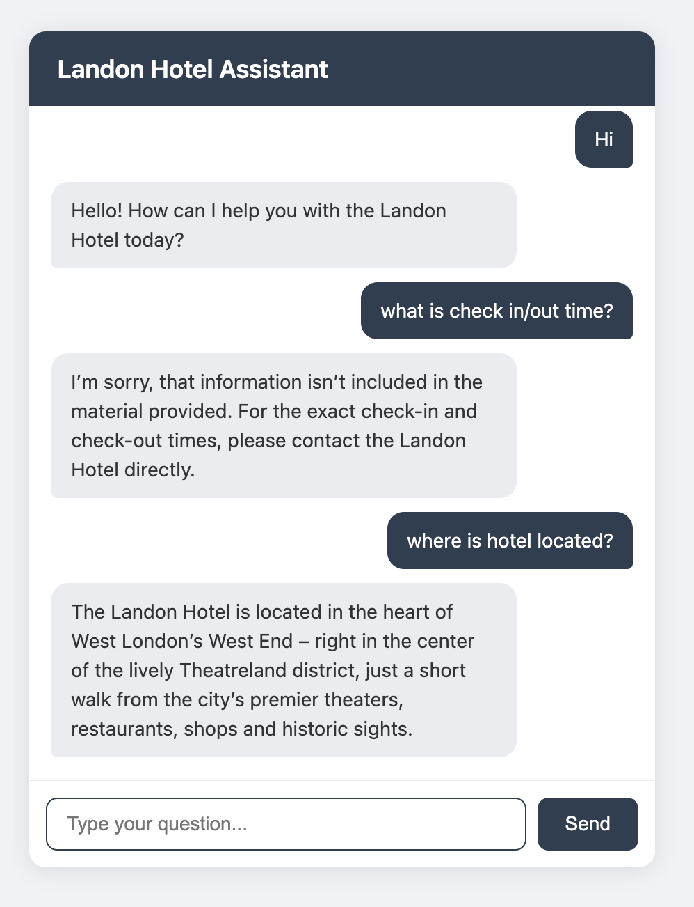

# AI Chatbot - Landon Hotel Assistant

An AI-powered chatbot that serves as a virtual hotel assistant for Landon Hotel. Built with Flask, LangChain, and OpenRouter, it answers guest queries about hotel services, policies, and guidelines.

## Screenshot



## Tech Stack

- **Backend:** Python, Flask
- **AI/LLM:** LangChain, OpenRouter (ChatOpenAI)
- **Data Extraction:** BeautifulSoup, PyMuPDF
- **Frontend:** HTML, CSS, JavaScript

## Setup

1. Install dependencies:
   ```
   pip install flask langchain langchain-openai python-dotenv beautifulsoup4 PyMuPDF requests
   ```

2. Create a `.env` file with your API key:
   ```
   OPENROUTER_API_KEY=your-api-key-here
   ```

3. Run the app:
   ```
   python llm.py
   ```

4. Open `http://127.0.0.1:5000` in your browser.